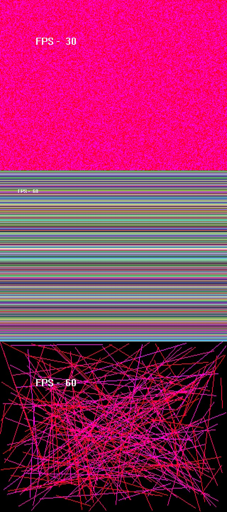



## Direct Memory Addressing \(Fast Pixels\) in DirectX7

### Description

Also known as Direct Memory Access. This is based on Andre Lamothe's method of plotting pixels. The purpose of this is to show people how to do direct memory addressing on the backbuffer surface to draw pixels extremly fast. Microsoft has hidden some useful things within DirectX in VB that make stuff like this possible. The main one that is needed is the pointer to the backbuffer surface called lpSurface (located and hidden in DDSURFACEDESC2.) If you want to see other hidden members, just go in object browser, right click, and goto Show Hidded Members. We now need an array that will point to the lpSurface (using Safe Array of course) that we can use to actually draw the pixels. We will call it Video_Buffer(). Depending on the color mode you are using though, you will need to declare Video_Buffer() with the same number of bytes the color mode is. For example, Video_Buffer() as Integer (2 bytes) for 16 bit color mode (2 bytes). Now the formula to plot the pixel is this: Video_Buffer(X + Y * Memory_Pitch) = Color.

The memory pitch (lPitch, located in

DDSURFACEDESC2) models the fact that a video card

might have some extra memory per line because of caches or hardware addressing. For example, your resolution set at 640x480x8 shows you have 640 bytes per line on the screen, but the memory pitch

is set at 1024 bytes per line in video memory. Of course, depending on what color mode you are using, you have to divide the memory pitch by the number of bytes your color mode is. Before you can actually write the pixel though, you have to lock the backbuffer surface and obtain the correct memory pitch (if you didn't, the memory pitch is useless.) Then you write the pixel, and unlock the backbuffer when done. I have three examples of how this can be useful. My only problem now is figuring out a way to Fillmemory in words (2 bytes) and Dwords (4 bytes) for fast scanline drawing. I have the assembly source code commented within this program (written by Andre Lamothe) but don't know how to use it in Visual Basic nor do I have any experience in assembly. Oh, well, at least I got this far. This program is heavily commented for those who are beginners. VOTES AND COMMENTS PLEASE!!!
 
### More Info
 

             |
---                |---
**Submitted On**   |2004-08-01 17:28:14
**By**             |[KRADLE OF FILTH](https://github.com/Planet-Source-Code/PSCIndex/blob/master/ByAuthor/kradle-of-filth.md)
**Level**          |Advanced
**User Rating**    |5.0 (10 globes from 2 users)
**Compatibility**  |VB 5\.0, VB 6\.0
**Category**       |[DirectX](https://github.com/Planet-Source-Code/PSCIndex/blob/master/ByCategory/directx__1-44.md)
**World**          |[Visual Basic](https://github.com/Planet-Source-Code/PSCIndex/blob/master/ByWorld/visual-basic.md)
**Archive File**   |[Direct\_Mem177657812004\.zip](https://github.com/Planet-Source-Code/kradle-of-filth-direct-memory-addressing-fast-pixels-in-directx7__1-55262/archive/master.zip)

